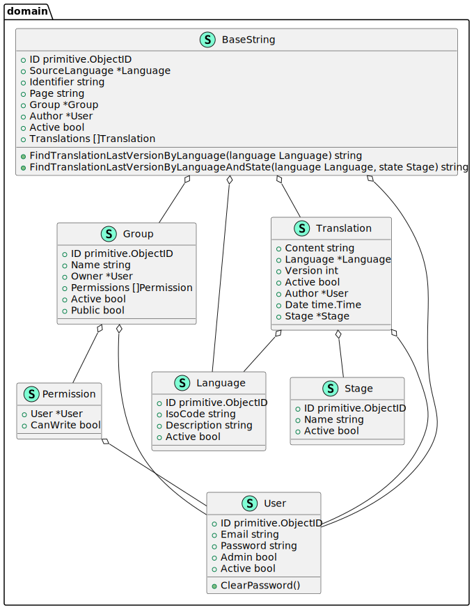

# API Rest con Go (Golang)

Development of a simple Rest API with [Go](https://golang.org/).


## Install project's dependencies

```shell
go get ./...
go mod tidy
```

## Makefile

If we use Windows, we must first install 'make' with Chocolatey. (Check permissions of the chocolatey
folder `(C:\ProgramData\chocolatey`)

```shell
choco install make
```

Then to execute any step we must enter the following command:

```shell
make <command> -B # Use -B to force to execute
```

## OpenApi

We must first install Swagger dependency:

```shell
go get -u github.com/go-swagger/go-swagger/cmd/swagger
```

Then execute the following command:

```shell
swagger generate spec -o swagger/swagger.json --scan-models
```

This action generate `swagger.json` that contains our documentation. Then we can start two types of documentation
server, Swagger or Redoc:

```shell
SwaggerUI: swagger serve -F=swagger swagger/swagger.json
Redoc: swagger serve -F=redoc swagger/swagger.json
```

These steps are configured in Makefile

### Add token to work Swagger

1. Click in this button.
   
2. Enter the token with the text `Bearer `
   

## How to generate a Mock from an interface

```shell
 mockgen -source=<source-file> -destination=<mock-file> -package=<package-name>
```

Example:

```shell
 mockgen -source=internal/core/service/UserService.go -destination=internal/core/service/mocks/UserServiceMock.go -package=mocks
```

# Create MongoDB with Docker

```shell
docker pull mongo
docker run -d --name mongo-on-docker -p 27017:27017 -e MONGO_INITDB_ROOT_USERNAME=mongoadmin -e MONGO_INITDB_ROOT_PASSWORD=secret mongo
```

To manage this database, it's recommended to install [MongoDB Compass](https://www.mongodb.com/try/download/compass)

## Generate UML model

Use these commands:

```shell
go install github.com/jfeliu007/goplantuml/parser
go install github.com/jfeliu007/goplantuml/cmd/goplantuml
go install ./...
make uml -B
```

_Note, when you want to generate UML, you need to change ID type to `string` to remove noise created by MongoDB._



